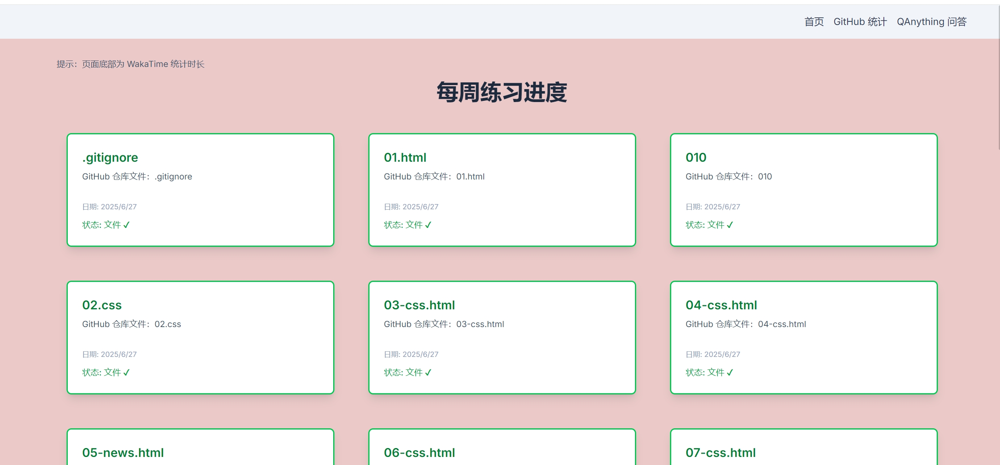
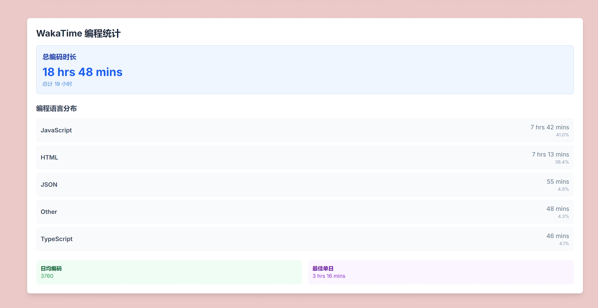
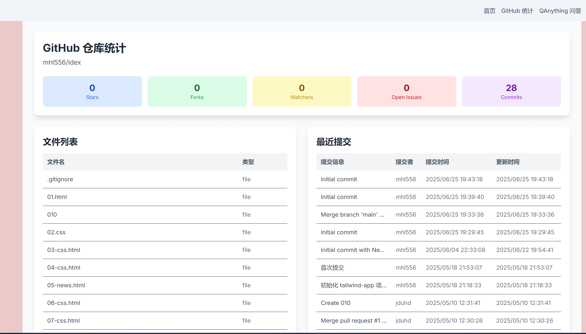

# Next.js 全栈开发实践项目

## 1. 项目简介

本项目是一个基于 Next.js 和 Tailwind CSS 构建的全栈 Web 应用，旨在展示和管理 Web 前端技术的学习与实践成果。项目集成了多项外部服务与 API，包括：

- **GitHub API**：动态拉取并展示指定仓库（`mhl556/idex`）的文件和目录结构。
- **QAnything 服务**：提供一个智能问答机器人界面，用户可以提出问题并获得解答
- 。
- **WakaTime API**：通过 Cloudflare Worker 中继，展示个人的编程活动统计数据。

项目前端采用响应式设计，后端逻辑通过 Next.js API Routes 实现，整体体现了现代 Web 开发的“约定优于配置”原则。

## 2. QAnything 集成路径与实现细节

为了将 QAnything 问答功能集成到项目中，我们采用了前后端分离的实现方案，以确保安全性和可维护性。

- **路径选择**：
  - **前端页面**：`src/app/q-anything/page.js`，作为问答功能的入口页面。
  - **核心组件**：`src/app/components/QAnything.js`，负责构建用户界面、处理用户输入和展示问答结果。
  - **后端 API 路由**：`src/app/api/q-anything/route.js`，作为代理服务器，负责安全地调用外部 QAnything API。

- **实现原因与细节**：
  - **安全性**：直接在前端调用 QAnything API 会暴露 `API Key`。通过在 Next.js 中创建一个后端 API 路由作为中介，可以将 `API Key` 等敏感信息存储在服务器端环境变量中（`.env.local`），避免了客户端泄露风险。
  - **逻辑分离**：前端组件专注于 UI 交互，后端路由处理数据请求和业务逻辑，符合关注点分离原则。
  - **实现流程**：用户在 `QAnything.js` 组件中输入问题并发起请求 -> 请求被发送到我们自己的后端 `/api/q-anything` -> 后端路由接收请求，并附加上 `API Key`，再将请求转发给真实的 QAnything 服务 -> 获取外部 API 的响应并返回给前端。

## 3. WakaTime API 集成方法

为了展示编程时长统计，我们集成了 WakaTime API，并通过 Cloudflare Worker 作为数据中继。

- **集成组件**：`src/app/components/WakaTimeStats.js` 是一个客户端组件，负责从我们的中继服务获取数据并渲染图表。
- **数据中继**：我们部署了一个独立的 Cloudflare Worker (`my-wakatime-worker`)，它负责调用 WakaTime API。这样做的好处是：
  1.  **隐藏 API 密钥**：WakaTime API 密钥安全地存储在 Worker 的环境变量中。
  2.  **解决 CORS 问题**：浏览器直接请求 WakaTime API 可能会遇到跨域限制，Worker 作为代理可以完美解决此问题。
  3.  **缓存与性能**：可以在 Worker 层添加缓存逻辑，减少对 WakaTime API 的请求频率。
- **实现流程**：`WakaTimeStats.js` 组件在加载时向 Cloudflare Worker 的 URL (`http://127.0.0.1:8787/`) 发送请求 -> Worker 收到请求后，使用预设的 API 密钥调用 WakaTime API -> Worker 将获取到的数据处理后返回给前端组件 -> 组件将数据显示为图表。

## 4. Next.js 项目结构
通过对练习卡片进行双击互动，从而实现具体内容的展现。
项目遵循 Next.js App Router 的标准目录结构：
/
├── app/                    # App Router 的根目录
│   ├── api/               # API 路由目录
│   │   └── q-anything/    # QAnything API 路由
│   │       └── route.js   # API 路由处理文件
│   ├── components/        # 共享组件目录
│   │   ├── ExerciseCard.js
│   │   ├── Greeting.js
│   │   ├── Navbar.js
│   │   └── PracticeCard.js
│   ├── globals.css        # 全局样式文件
│   ├── layout.js          # 根布局组件
│   └── page.js            # 首页组件
├── public/                # 静态资源目录
│   ├── file.svg
│   ├── globe.svg
│   ├── next.svg
│   └── vercel.svg
├── .gitignore             # Git 忽略文件
├── next.config.ts         # Next.js 配置文件
├── package.json           # 项目依赖配置
├── postcss.config.mjs     # PostCSS 配置
└── tsconfig.json          # TypeScript 配置

## 5. 仓库内容展示与整合方式

项目首页动态展示了 GitHub 仓库 `mhl556/idex` 的内容。

- **数据获取**：首页组件 `src/app/page.js` 在客户端通过 `useEffect` Hook 调用 GitHub API (`https://api.github.com/repos/mhl556/idex/contents`) 来获取仓库根目录下的文件和文件夹列表。
- **组件渲染**：获取到的列表数据被用来动态渲染 `PracticeCard` 组件。每个文件或文件夹都对应一个卡片。
- **交互体验**：`PracticeCard.js` 组件被设计为可点击的卡片。根据项目类型（文件或目录），点击卡片会打开一个新的浏览器标签页，直接跳转到该项目在 GitHub 上的对应页面。

## 6. 项目运行指南

请按照以下步骤在本地运行本项目：

1.  **克隆仓库**

    ```bash
    git clone <your-repository-url>
    cd nextjs-tailwind-homework
    ```

2.  **安装依赖**

    ```bash
    npm install
    ```

3.  **配置环境变量**

    在项目根目录下创建一个名为 `.env.local` 的文件，并添加 QAnything 服务所需的配置：

    ```
    QANYTHING_API_URL=https://your-qanything-api-endpoint.com
    QANYTHING_API_KEY=your-secret-api-key
    ```

4.  **运行 WakaTime 中继服务**

    确保 `my-wakatime-worker` 正在本地或云端运行，并且前端可以访问到它（默认为 `http://127.0.0.1:8787/`）。

5.  **启动开发服务器**

    ```bash
    npm run dev
    ```

6.  **访问项目**

    在浏览器中打开 `http://localhost:3000` 即可查看项目。
## 7.运行截图

### 每周练习进度页面（点击练习卡片可以跳转到具体代码）

*展示了各个练习项目的完成状态，包括.gitignore、01.html、010等文件的学习进度*

### GitHub 仓库统计

*显示了GitHub仓库的统计信息，包括Stars、Forks、Watchers等数据，以及文件列表和最近提交记录*

### 网页设计说明页面

*展示了网页设计的相关说明和Next.js技术栈介绍*

### 项目功能展示

*展示了项目的主要功能和用户界面*

